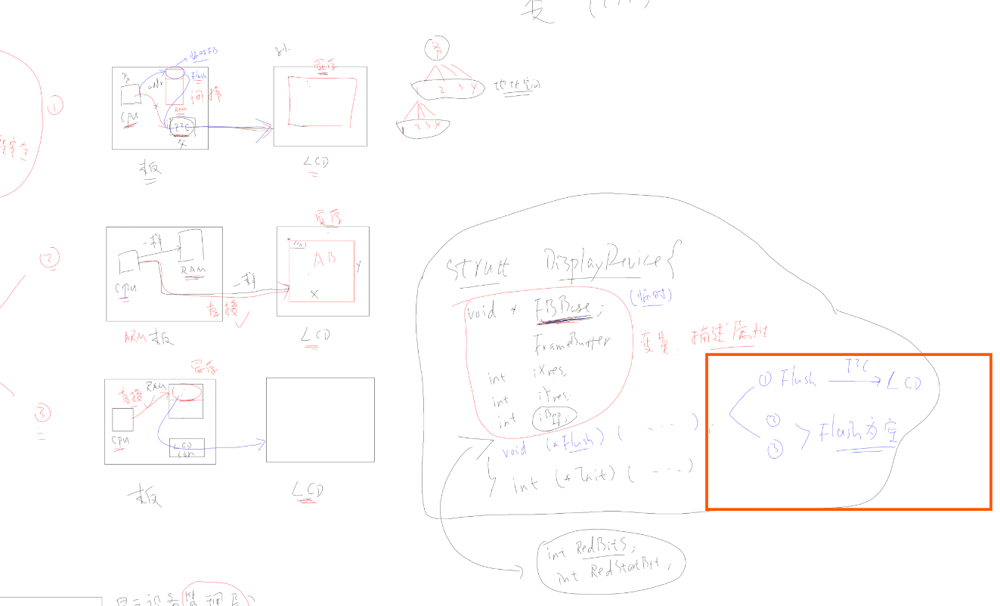

# embedded-mastary
lean and practice

## 2025年2月23日总结 第一周

主要是进行c语言的总结提高。

### 1.学习了韦东山的c语言加强的课程。

volatile 关键字 map文件查看全局变量

结构体 ：
内存对齐，位域操作（2进制位）

联合体内存共用。

指针，结构体指针和函数指针

链表的插入和删除

全局变量和局部变量从flash到内存的方式
- 全局变量的初始化
类型memcpy，把flash上的数据段，整体拷贝到RAM
- 初始值为0，没有初始化的全局变量，怎么初始化？
- 有100万个这样的变量，都保存再flash上？
- 这些变量在内存里放在ZI段
- 类似memset,把ZI段全部清零

### 2.c语言的本质

系统栈空间的手动分配
push和pop的存取数据顺序

堆的手动分配。

函数的本质：就是一系列的指令：就是一系列的机器码。
从flash 复制到内存。
- 调用函数：让CPU的PC寄存器等于“一系列机器码”的首地址，就是函数地址

指针的本质

- 指针变量，也是一个变量，存放的是“首地址”；对于cpu来说，一个地址对应一个字节。
假设a是int型。首地址是0x2000,0010,第二个字节就是0x2000,0011.第三个字节就i是0x2000,0012

c语言的本质就是内存的读写和修改。

复杂的结构体和字符串等是从flash里拷贝到ram中

### 3.c语言面对对象
1.使用结构体抽象出数据

2.使用函数指针放在数组里

3.使用结构体数组赋值

调用时只需要定义一个数组指针在调用方法就可以了。

判断设备类型 ，选择对应的方法

#### 程序分层

管理层：什么也不用管
输入设备：区分不同的操作系统
内核抽象层 ：区分哪种芯片
芯片抽象层：不同的芯片有没有hal库支持

#### 消抖
使用软件定时器

两个按键就需要两个定时器，够吗？ 使用软件定时器 就够

假如设定了一个闹钟：这时候他记录下当前的时间+增加的时间。 硬件定时 tick 不断在累加，累加到和 当初设定的时间一边长了，就溢出。需要在 systick 函数内循环判断。

#### 显示设备的结构体抽象。

直接读写内存和使用i2c接口 使用屏幕

可重入和不可重入函数
可重入函数： 多个任务调用这个函数没有问题。

不声明就无法使用？
对于变量来说是对的，对于函数来说是错的。

回调和钩子函数
函数指针，先设置好指向哪个函数。发生啥事件的时候调用这个函数